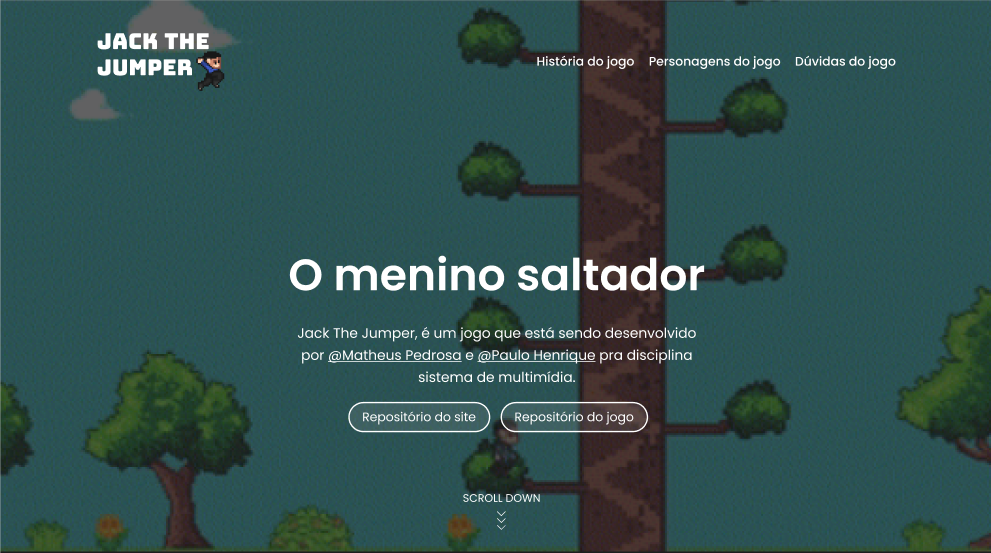

<h1 align="center">Jack The Jumper 🎮</h1>

    <h4>
    <a href="https://phenrique01.github.io/Jack-The-Jumper/">Clique para visitar o site | </a>
    <a href="https://www.figma.com/design/A3dSfxgXB3coJAzQsrpeQR/prototipo-site-jogo?node-id=0%3A1&t=9AvdTITsjMBmYgkt-1"> | Clique para ver o protótipo</a>
    </h4>

<h2>Seções do site 📚</h2>

<ul>
    <li>Home: Uma introdução do jogo;</li>
    <li>História do jogo: Uma pequena história e um trailer do jogo;</li>
    <li>Personagens do jogo: Uma pequena informação de cada personagem do jogo;</li>
    <li>Dúvidas do jogo: Algumas dúvidas sobre o jogo.</li>
</ul>

---

<h2>Tecnologias utilizadas 💼</h2>

Para o desenvolvimento do site foi utilizado as tecnologias:

<ul>
    <li>HTML;</li>
    <li>CSS;</li>
    <li>JavaScript.</li>
</ul>

---

<h2>Desenvolvedores 👨‍💻</h2>

<ul>
    <li><a href="https://github.com/matheuspedrosam">@Matheus Pedrosa</a></li>
    <li><a href="https://github.com/PHenrique01">@Paulo Henrique</a></li>
</ul>